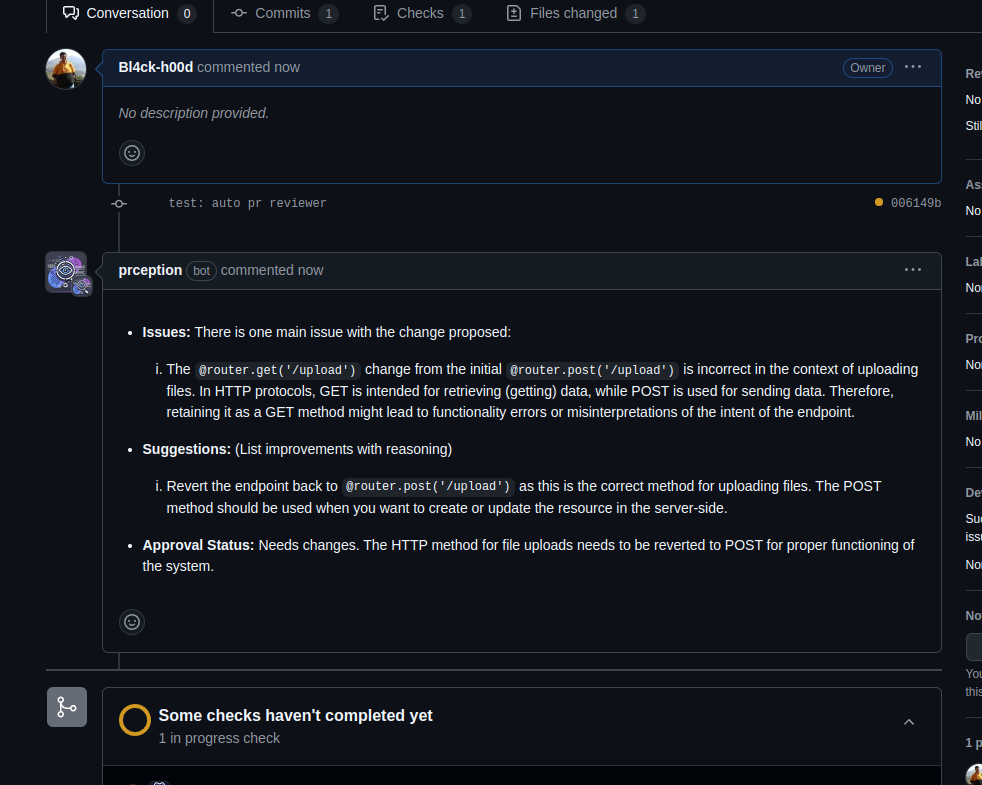

# 🚀 PRception - AI-Powered PR Review & Approval Bot 🤖  

PRception is a GitHub App that automates pull request reviews using AI-powered code analysis. It provides **intelligent, context-aware feedback**, suggests improvements, and can **automatically approve PRs** that meet defined quality standards — saving developers time and ensuring consistent code quality.  


## ✨ Features  
✅ **Automated Code Review** – PRception analyzes code changes using GPT-4 and posts suggestions directly in the PR  
✅ **Automatic Approval** – PRception can automatically approve PRs if they meet quality criteria  
✅ **Context-Aware Feedback** – Provides line-by-line feedback based on code context  
✅ **Diff Analysis** – Analyzes PR diffs to detect issues and improvements  
✅ **Customizable Review Rules** – Define custom rules and quality standards  
✅ **Secure Authentication** – Uses GitHub App with JWT-based authentication  
✅ **Scalable** – Works seamlessly with large repositories and complex codebases  
✅ **Multi-Repo Support** – Supports reviewing across multiple repositories in an organization  

---

## 📋 Prerequisites  
Ensure you have the following installed:  
- 🏆 **Go** (1.22 or higher)  
- 🐳 **Docker** (latest version recommended)  
- 🔑 **GitHub App credentials** (App ID and Private Key)  
- 🧠 **OpenAI API key**  

---

## 🔑 Environment Variables  
Create a `.env` file in the project root with the following:  

```env
GITHUB_APP_ID=your_app_id
GITHUB_PRIVATE_KEY=your_base64_encoded_private_key
OPENAI_API_KEY=your_openai_api_key
```

## 🚀 Installation

### 1️⃣ Clone the repository:
```bash
git clone https://github.com/yourusername/prception.git
cd prception
```

### 2️⃣ Install dependencies:
```bash
go mod download
```

### 3️⃣ Set up your GitHub App:

1. Go to *GitHub → Settings → Developer Settings → GitHub Apps*

2. Create a new app

3. Set the following permissions:
* ✅ PR read/write
* ✅ Contents read

4. Subscribe to Pull Request event

5. Generate and download the private key

6. Install the app in your repository

### 4️⃣ Build and run locally:

```bash
./scripts/start.sh
```

## 🐳 Docker Deployment
You can deploy PRception using Docker for easy scalability and portability:

### Build the container:
```bash
docker build -t prception .
```

### Run the container:
```bash
docker run -d -p 8080:8080 --env-file .env prception
```

## 🔄 How It Works

1. A PR is opened → GitHub sends a webhook to PRception
2. PRception fetches the PR diff and changed files
3. Code is analyzed using *GPT-4* to detect issues and improvements
4. Intelligent review comments are posted directly on the PR
5. If the code meets the defined standards, PRception automatically approves the PR


## 🏆 Example PR Feedback



